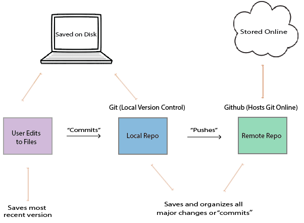
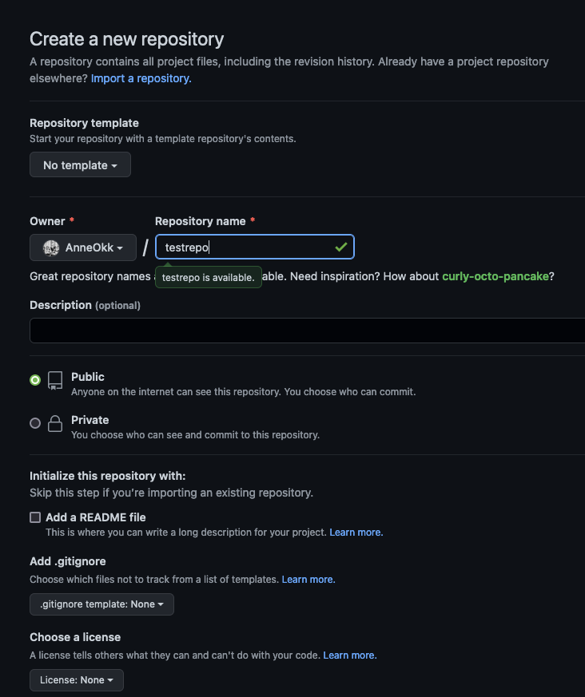
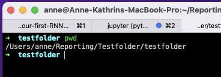
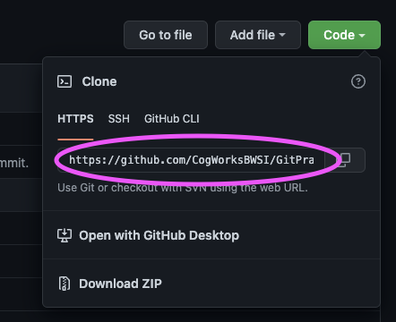
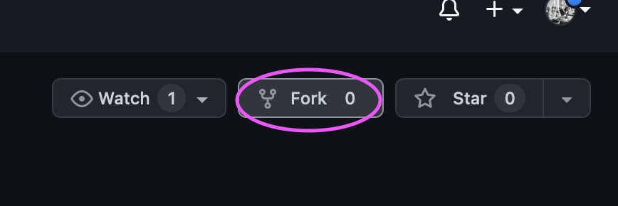
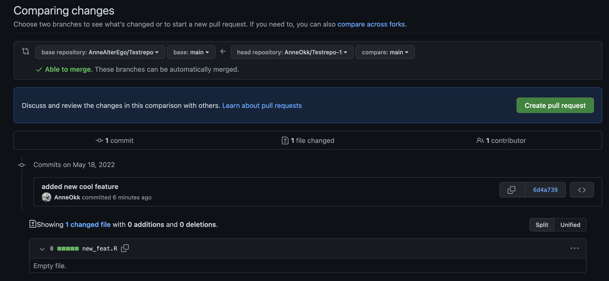

name: Rmarkdown Intro
class: left, middle
background-image: url(img/yoal-desurmont-jqgsM3B9Fpo-unsplash.jpg)
background-size: cover

<h1><span style="color:white"> .fat[.fancy[R Markdown Workshop - Day 2]]</span>
<br /> 
<br /> 

<h2><span style="color:white"> .fancy[Creation, organisation, storage, and collaboration]</span>

<h3><span style="color:white"> Anne-Kathrin Kleine | University of Groningen </span>


<!-- this ends up being the title slide since seal = FALSE-->


```{r setup, include=FALSE}
options(htmltools.dir.version = FALSE)
library(knitr)
knitr::opts_chunk$set(warning = FALSE, message = FALSE)
# options(knitr.table.format = "html")
library(tidyverse)
library(babynames)
library(fontawesome) # from github: https://github.com/rstudio/fontawesome
library(DiagrammeR)
library(rmarkdown)
library(haven)
library(magick)

hook_source <- knitr::knit_hooks$get('source')
knitr::knit_hooks$set(source = function(x, options) {
  x <- stringr::str_replace(x, "^[[:blank:]]?([^*].+?)[[:blank:]]*#<<[[:blank:]]*$", "*\\1")
  hook_source(x, options)
})
```


<style type="text/css">

.hljs-github .hljs {
    background: #D3D3D3;
}

.inline-c, remark-inline-code {
   background: #228B22;
   border-radius: 3px;
   padding: 4px;
   font-family: 'Source Code Pro', 'Lucida Console', Monaco, monospace;
}


.blue-h{
   background: #1261A0;
}


.out-t, remark-inline-code {
   background: #1261A0;
   border-radius: 3px;
   padding: 4px;
   
}

.pull-left-c {
    float: left;
    width: 58%;
    
}

.pull-right-c {
    float: right;
    width: 38%;
    
}

.left2 {
  margin: 0;
  position: absolute;
  top: 50%;
  left: 20%;
  -ms-transform: translate(-50%, -50%);
  transform: translate(-50%, -50%);
    
}

--

.right2 {
  margin: 0;
  position: absolute;
  top: 50%;
  left: 80%;
  -ms-transform: translate(-50%, -50%);
  transform: translate(-50%, -50%);
    
}

--

.center2 {
  margin: 0;
  position: absolute;
  top: 50%;
  left: 50%;
  -ms-transform: translate(-50%, -50%);
  transform: translate(-50%, -50%);
}


.medium {
    font-size: 75%
}

.small {
    font-size: 50%
    }

.action {
    background-color: #f2eecb;
  
}


</style>
    

<!-- this adds the link footer to all slides, depends on my-footer class in css-->

---

class: middle, inverse

# .fat[.fancy[Version control]]

---
class: middle, inverse

## .fancy[Version control] 🎛

.pull-left[
- Research papers have many versions before publication
- two main challenges:
  - keeping track of changes and versions
  - reverting a previous version if necessary 
- different approaches for version control:
  - edit, rename and save files
  - use applications (Dropbox, Google Docs, Overleaf)
  - use version control systems such as Git and GitHub 
]

.pull-right[
```{r eval=FALSE}
manuscript
   |
   |- journals_FINAL_19May.Rmd
   |- journals_PAPERVERS_17May.Rmd
   |- journals_10May.Rmd
   |- journals_FINAL.Rmd
   |- journals_26APRIL_newliterature.Rmd
   
   ...
   
   |- journals.Rproj
   |- references.bib  
   |- apa_7th.csl
   
```
]
---
class: middle, inverse

# .fat[.fancy[Version control with Git and GitHub]]

---

class: middle, inverse

## .fancy[Advantages of using Git and GitHub]

.pull-left[


#### 🎈 Contribute to open source projects, see [here](https://www.dataschool.io/how-to-contribute-on-github/)
- almost all open source projects use GitHub

#### 🎤 Showcase your work


#### 🔍 Track changes across versions 
]

.pull-right[
#### 👨‍🔬 👷‍♀️ Collaborate on projects 


#### 🤹‍♂️ Various integration options
- GitHub can integrate with many common platforms such as Amazon and Google Cloud; or use GitHub pages or Netlify to build websites based on your R (Markdown) files 
]
---
class: middle, inverse

## .fancy[Version Control &mdash; Git and GitHub &mdash; Definitions]

### Git 

- a software that keeps track of versions of a set of files
- it is *local* to you; the records are kept on your computer

--

### GitHub 

- a hosting service that can keep the records
- it is *remote* to you, like Dropbox
- GitHub is specifically structured to keep records with Git


---
class: middle, inverse

## .fancy[Version Control &mdash; Git and GitHub &mdash; Definitions]

### Repository, or repo
- a set of files whose records are kept together, by Git and/or on GitHub

--

### To commit
- to take a snapshot of a repository
- it is like saving a new version of all files and sub-folders in your project folder with a new name
- it is local, the records are kept on your computer unless you push

--

### To push
- to move a copy of the records from Git to GitHub, from your computer to online server
- it is like uploading (the new versions of) your files and sub-folders to a website

---

class: center, inverse

## .fancy[Version Control &mdash; Git and GitHub]

<figure>
    
    <figcaption>
    <a href="https://iqss.github.io/dss-rbuild/version-control.html">Source: https://iqss.github.io/dss-rbuild/version-control.html</a></figcaption>
</figure>


---

class: middle, inverse

## .fat[.fancy[How familiar are you with using the command line (terminal, power shell...)?]] 

### Go to [https://www.menti.com/9eof4daf4h](www.menti.com) 🤸 (and enter the code **4173 2433**) 

### [See results](https://www.mentimeter.com/app/presentation/8377d55da27523147614cd11aba6f796/82eb3869f165)

---

class: middle, inverse

## .fancy[Version Control &mdash; Git and GitHub &mdash; check setup]

#### In the 📱 terminal 📱: ` git --version ` 
- you should see the Git version  ✅

#### In the 📱 terminal 📱: ` git config --global user.name ` 
- you should see the Git user name  ✅

<br /> 

#### 🚫 If these steps did not work, go back [here](https://docs.github.com/en/get-started/getting-started-with-git/setting-your-username-in-git) and continue setting up Git where you left off

#### Don't want to use the terminal ❓ ▶ For version control in RStudio, see [here](https://support.rstudio.com/hc/en-us/articles/200532077-Version-Control-with-Git-and-SVN), and particularly [**this video**](https://www.youtube.com/watch?v=megZYkCLMA4)
---

class: middle, inverse

## .fancy[Version Control &mdash; Git and GitHub &mdash; connect local with remote]

.pull-left[
#### 1. Go to GitHub and create a new repository 


]

.pull-right[

#### 2. Fill in some info, create a public repository (don't bother with Readme etc - those will be added later!)


]
---

class: middle, inverse

## .fancy[Version Control &mdash; Git and GitHub &mdash; connect local with remote]

.pull-left[
#### 3. Follow the steps in Option 1: .blue-h["…create a new repository on the command line"] 


]

.pull-right[

#### 4. In the 📱 terminal 📱, navigate to your R project folder 

]

---

class: middle, inverse

## .fancy[Version Control &mdash; Git and GitHub &mdash; connect local with remote]

.pull-left[
#### 5. In the 📱 terminal 📱, type:

.blue-h[`git init`] this initializes a git repo on your local machine

.blue-h[`touch README.md`] this creates an empty README file

.blue-h[`git add .`] this stages all the content in that folder to be committed

.blue-h[`git commit -m "add empty readme"`] stages all content to be pushed in next step


]

.pull-right[

.blue-h[`git remote add origin https://github.com/AnneOkk/testrepo.git`] substitute with your repo URL 

.blue-h[`git push origin master`] push all the content from Git to GitHub


]

--

### 🎈 .fancy[Pushed files should appear in GitHub repository] 🎈


---

class: middle, inverse

## .fancy[Version Control &mdash; Git and GitHub &mdash; .gitignore]

.pull-left[

- .blue-h[`.gitignore`] file specifies which file(s) and/or folder(s) should be excluded from version control

- lists one item per line; each line has a pattern, which determines whether files should be ignored 

- see [gitignore documentation](https://git-scm.com/docs/gitignore) for more info on the different patterns 

- reasons to exclude files from being pushed include:
  - personal information others should not see (e.g., credential files)
  - no rights to share (e.g., certain data files)
  - outputs that may be re-created (e.g., `outputs.pdf`)
]

.pull-right[


]

???
for stuff added to gitignore: clear cache before staging for commit!  
git rm -rf --cached .
---

class: middle, inverse

## .fancy[Version Control &mdash; Git and GitHub &mdash; collaborating]


### Imagine... 🤔

--

#### ...you work in a team of data scientists/ data enthusiastic researchers 🧙🧙🏿🧙‍♀️🧙🏻‍♀️

--

#### ...you want to be able to work together on a data analysis project 👨‍💻👩‍💻 👨‍💻👩‍💻

--

#### ...you want to keep track of what the others do and finally merge individual contributions into one overall project  ✨ 💾 ✨

--

### But how ❓ 🤷 
---

class: middle, inverse

## .fancy[Version Control &mdash; Git and GitHub &mdash; collaborating]

## .fancy[Scenario 1 - you are owner/ collaborator]


### ... first things first!

--

.pull-left[

#### 1) Go to the GitHub repository you are working on as a team 

#### 2) In the 📱 terminal 📱, navigate to where you want to store the project files and type:


##### .blue-h[`git clone https://github.com/AnneOkk/testrepo.git`] 


]

.pull-right[


]

???

Inviting collaborators to a personal repository
- Ask for the username of the person you're inviting as a collaborator. ...
- On GitHub.com, navigate to the main page of the repository.
- Under your repository name, click Settings.
- In the "Access" section of the sidebar, click Collaborators & teams.
- Click Invite a collaborator.

---

class: middle, inverse

## .fancy[Version Control &mdash; Git and GitHub &mdash; collaborating]

#### 3) Next, you would always want to make sure that you are up to date with what has changed in the remote repository

--


#### In the 📱 terminal 📱, type:

.blue-h[`git pull origin master`] 

--

4) Create a new branch to add changes that belong to a novel feature you are working on (this prevents messing up the master branch)

.blue-h[`git checkout -b "cool-feature"`]

--

5) Now make some changes (e.g., add the new cool feature)

--

6) Add, commit, and push the files 
...through the usual workflow (`git add .`, `git commit -m "new feature file added"`) 😴


--

 🚧 👀 BUT you push the changes to the newly created branch to prevent messing up the master branch! 👀 🚧

.blue-h[`git push origin cool-feature`]


---

class: middle, inverse

## .fancy[Version Control &mdash; Git and GitHub &mdash; collaborating]


7) On GitHub, you create a pull request

Reviewers (other team members) may be assigned to check the changes and start a conversation (through comments)

--

8) Once all issues are resolved, your changes will be merged into the master branch 🥳 


---

class: middle, inverse

## .fancy[Version Control &mdash; Git and GitHub &mdash; collaborating]

... But what if some issues remain unresolved?  👆"You forgot to read in the data!" 🤔

--

If the branch has not been removed, you may add smaller changes (on the same feature) through `git add .`, `git commit -m "added data reader"`, `git push origin branch-name`

--

❗ BUT if some time has passed and/or the addition is major❗

--

⏩ Checkout to the master branch:

.blue-h[`git checkout master`]

--

Pull all changes that happened in the mean time:

.blue-h[`git pull origin master`]

--

Checkout a new branch for the missing feature;

.blue-h[`git checkout -b data-reader`]

--

Make the necessary changes!

--

... And then, the usual workflow (don't forget to push to new branch!)


---

class: middle, inverse

## .fancy[Version Control &mdash; Git and GitHub &mdash; collaborating]

## .fancy[Scenario 2 - you want to contribute to an open science project]


--

1) In GitHub, navigate to the [project](https://github.com/AnneAlterEgo/Testrepo/tree/main) you want to contribute to 

--

2) Fork the repo!



--

 3) Clone the new repo! 

.blue-h[`git clone https://github.com/AnneOkk/Testrepo-1.git`] 

---

class: middle, inverse

4) Make your changes and then add, commit, and push to your master branch 

--

5) On GitHub, go back to the original repository and create a pull request. 

You may need to click "compare across forks"



---

class: middle, inverse

### ... On the other side 


Open and review the pull request! 🔍

If you're happy with the changes, merge! 👍

Otherwise, request additional changes in comments. 💬

--

###🎊 Yey, you're all set to contribute to open science projects on GitHub! 🎊

---

class: middle, inverse

# .salt[.fancy[Your turn! 🤹]]

1.  Connect your local R project folder with a GitHub repository

2. Change some of the content in R, save, and then push the changes to GitHub
  - .blue-h[`git add .`]
  - .blue-h[`git commit -m "senseful commit message that describes the change(s)"`]
  - .blue-h[`git push origin master`]

    <br /> 

3. [OPTIONAL] Create a pull request for your own repository and merge the changes into the master branch 

4. [OPTIONAL] One team member creates a pull request for the other team member's repository (first fork and clone); the repo owner merges the changes into her/his master (or main) branch. 


---

class: middle, inverse

# .fat[.fancy[Meet blogdown]]


### .fancy[Making Websites in R Markdown]

### Material adapted from [Alison Hill and Yihui Xie's Advanced R Workshop](https://github.com/rstudio-education/arm-workshop-rsc2019)
---

class: middle, inverse

## .fancy[What is blogdown?]


---
class: middle, inverse

## .fancy[What is blogdown?]

.pull-left[

]

.pull-right[
- Hugo is a static site generator 
- free, open-source, relatively easy to use
- extremely fast and multiple purpose (websites, blogs,...)
]

---

class: middle, inverse

## .fancy[Why not WordPress, Tumblr, Medium.com, Blogger.com, etc?]

- No R Markdown support (even math support is often nonexistent or awkward)

- If all you want to write about is what you had for breakfast today, or how cute your kittens are, there is no need to use blogdown. If there is anything related to R, statistical computing, and/or graphics, blogdown will be much more convenient.

---
class: inverse, middle, center

# .fancy[Build a site for your project]

```{r echo = FALSE, out.width='60%'}

```

---
name: start-here
class: inverse, middle

## .fancy[.center[Build a site local with GitHub]]

### .fancy[.center[`r emo::ji("computer")` + <i class="fab fa-github fa-lg fa-fw"></i>]]

1. Create an R blogdown project

1. Make a [repo on <i class="fab fa-github fa-lg fa-fw"></i>GitHub](https://happygitwithr.com/new-github-first.html#make-a-repo-on-github-1)

1. Connect remote repo to local 


---
name: block1
class: middle, inverse, center

# `r emo::ji("crystal_ball")`

## .fancy[Gaze into your directory structure]

.footnote[
https://bookdown.org/yihui/blogdown/a-quick-example.html
]


---
class: inverse, middle

name: dir-structure

# `r emo::ji("closed_lock_with_key")` Directory Structure

```{r eval = FALSE}
.
├── R
├── config.yaml
├── content
├── website.Rproj
├── index.Rmd
├── layouts
├── netlify.toml
├── public
├── resources
├── static
└── themes
```


---
class: inverse, middle

name: hugo-index

# `r emo::ji("closed_lock_with_key")` Directory Structure

```{r eval = FALSE}
.
├── R
├── config.yaml
├── content
├── website.Rproj
├── index.Rmd # DO NOT TOUCH! #<<
├── layouts
├── netlify.toml
├── public
├── resources
├── static
└── themes
```

--

```{yaml}
---
site: blogdown:::blogdown_site
---
```

???

index.Rmd does one thing- let's open it up- it is your only R markdown YAML. It specifies your output format as a blogdown site. This is specific to using Hugo via blogdown.


---
class: inverse, middle

name: hugo-public

# `r emo::ji("closed_lock_with_key")` Directory Structure

```{r eval = FALSE}
.
├── R
├── config.yaml
├── content
├── website.Rproj
├── index.Rmd 
├── layouts
├── netlify.toml
├── public # IGNORE! #<<
├── resources
├── static
└── themes
```

???


public is where your final rendered site files will go

You can mostly ignore this folder- it re-generates every time we serve our site


---
name: noknit
class: middle, inverse, center

# DON'T `r emo::ji("knit")` KNIT!


---
name: serve

class: center, inverse, middle

# `r emo::ji("bellhop_bell")`

# .fancy[Serve site!]

Mouse up to "Addins" `r emo::ji("arrow_right")` "Serve site"


---
class: center, inverse, top

# `r emo::ji("peacock")` Success?


```{r echo = FALSE, out.width='75%'}

```


.footnote[
.fancy[.bright["Show in new window"]] to see in local browser
]

---
name: earlydeploy
class: middle, inverse, center

# .fat[.fancy[Publishing]] `r emo::ji("mega")`

---
template: earlydeploy

## Go to [Netlify.com](https://www.netlify.com/) & Log in

```{r echo = FALSE}

```

---
template: earlydeploy


## Connect netlify with to GitHub repository 
```{r echo = FALSE}

```

---

template: earlydeploy

## Configure Netlify on GitHub
```{r echo = FALSE}
knitr::include_graphics("img/confignet.png")
```

---
name: livereload

class: center, inverse, middle

# `r emo::ji("bellhop_bell")`

# .fancy[Click save!]

Through the magic of .fancy[.bright[LiveReload]], 
you don't need to serve your site again.


???

What are we seeing here? Everything that is the public folder. 

---
name: hugo-themes

# `r emo::ji("closed_lock_with_key")` Directory Structure

```{r eval = FALSE}
.
├── R
├── config.yaml
├── content
├── website.Rproj
├── index.Rmd 
├── layouts
├── netlify.toml
├── public 
├── resources
├── static
└── themes # Do NOT TOUCH! #<<
```

???

themes is where all the Hugo theme files go.

This determines the look and layout of your site, as well as the bells and whistles that each individual Hugo theme developer employs. It also may leave out some Hugo bells and whistles that you DO want. 

IT ALL DEPENDS ON YOUR THEME

You also never touch this folder!

So how do you edit a Hugo theme if you are not to touch anything in this folder?

---
class: middle, inverse

## .fancy[Themes]

Look in `/themes/hugo-lithium/`. Notice now the folder structure here *mirrors* your Hugo directory structure.

```{r echo = FALSE, out.width='80%'}

```

---

class: middle, inverse

## .fat[.fancy[Choose your theme]]

.pull-left[
```{r echo = FALSE, out.width='90%'}

``` 
]

.pull-right[
### follow the instructions
```{r echo = FALSE, out.width='90%'}

``` 
]

---
class: middle, inverse

## .fat[.fancy[Install theme using blogdown]]

```
blogdown::install_theme(theme = "lxndrblz/anatole",
theme_example = TRUE, 
update_config = TRUE)
```

---
class: middle, inverse

name: hugo-blog

## .fat[.fancy[Archetypes]]

They are like a template for the content on your site  
You may create your own archetypes! See the blog posts [here](https://www.apreshill.com/blog/2019-02-spoonful-archetypes/) and [here](http://lcolladotor.github.io/2018/03/08/blogdown-archetype-template/)

```{r eval = FALSE}
.
├── categories.md
├── default.md
└── tags.md
```

---

class: inverse, middle

## .fat[.fancy[Layouts]]

They control the looks of elements on your site   
Since you should not touch the theme folder's files, this is where you can easily customize certain parts of your website  
See [here](https://github.com/yihui/hugo-xmin/tree/4bb3052d17101512ca1f5c621d7aca66fd9638d1/layouts) for an example

```
<footer>
  {{ partial "foot_custom.html" . }}
  {{ with .Site.Params.footer }}
  <hr/>
  {{ . | markdownify }}
  {{ end }}
  </footer>
  </body>
</html>
```
---
name: block4
class: middle, inverse, center

# `r emo::ji("postal_horn")`

## .fat[.fancy[Add new content]]

.footnote[
https://bookdown.org/yihui/blogdown/rstudio-ide.html
]

---
class: middle, center

```{r echo = FALSE, out.width='70%'}

```

---
class: middle, inverse

name: global-options

# `r emo::ji("earth_africa")` Other global options

```{r eval = FALSE}
library(usethis)
edit_r_profile()
options(blogdown.author = "Author Name",
        blogdown.ext = ".Rmd",
        blogdown.subdir = "blog",
        blogdown.yaml.empty = TRUE,
        blogdown.new_bundle = TRUE,
        blogdown.title_case = TRUE)
```

.footnote[
[Global options](https://bookdown.org/yihui/blogdown/global-options.html)

[More global options](https://bookdown.org/yihui/blogdown/more-global-options.html)
]

---
class: middle, inverse

name:workflow

# .fat[.fancy[Workflow]]


- Open your website project, click the "Serve Site" addin
    
- Revise old pages/posts, or click the "New Post" addin
    
- Write and save (take a look at the automatic preview)
    
- Push everything to Github

---
class: middle, inverse

## .fat[.fancy[Blogdown resources]]

- [Blogdown demo site](https://blogdown-demo.rbind.io)
- [Blogdown book](https://bookdown.org/yihui/blogdown/)
- [I did a blog post on it](https://alison.rbind.io/post/up-and-running-with-blogdown/)
- [Also did a workshop](https://alison.rbind.io/talk/blogdown-meetup/)
- [Yihui's slides from RStudio Conf](https://slides.yihui.name/2018-blogdown-rstudio-conf-Yihui-Xie.html)

---
class: middle, inverse

# `r emo::ji("newspaper")` Want to change the landing page?

You need to do two things:

1. add an `_index.md` file to `content/` (not in a subfolder)
1. update the `index.html` layout


